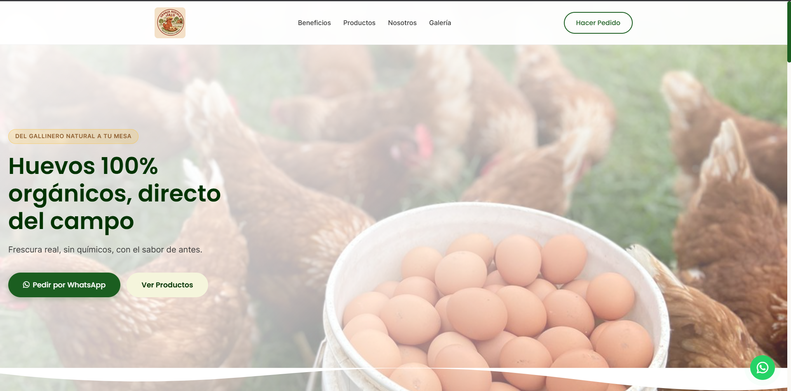
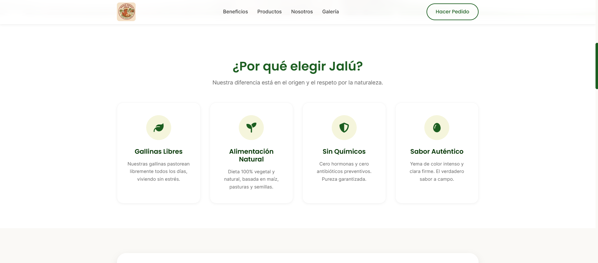
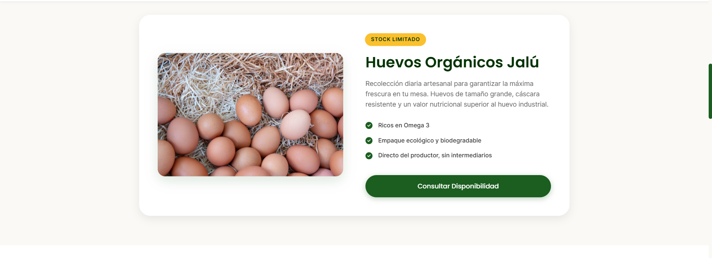
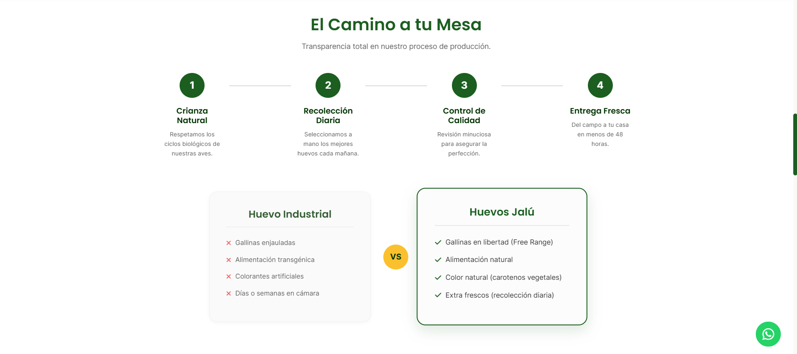
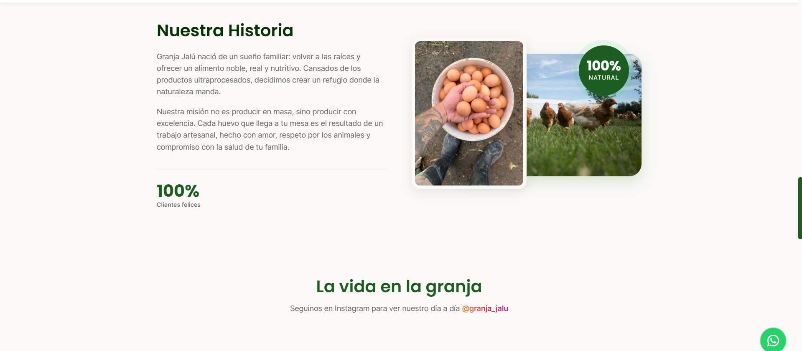

# 🥚 Granja Jalú - Landing Page


Una landing page moderna y profesional diseñada para **Granja Jalú**, una granja avícola enfocada en la producción y venta de huevos 100% orgánicos, de gallinas libres de jaula.

Este sitio web está optimizado para conversiones, guiando al usuario de manera intuitiva hacia la realización de pedidos mediante WhatsApp, mientras transmite confianza, calidad y un fuerte vínculo con la naturaleza.

## 📸 Capturas de Pantalla

*(Nota: Para que estas imágenes se vean correctamente en tu GitHub, asegúrate de guardar las capturas que me enviaste en la carpeta `assets/` de tu proyecto con los nombres indicados)*

### 1. Vista Principal (Inicio)
<div align="center">
  
  <br><em>Landing Page - Bienvenida</em>
</div>
<br>

### 2. Beneficios de nuestros productos
<div align="center">
  
  <br><em>¿Por qué elegir Jalú?</em>
</div>
<br>

### 3. Detalle del Producto
<div align="center">
  
  <br><em>Huevos Orgánicos Jalú</em>
</div>
<br>

### 4. Transparencia y Proceso
<div align="center">
  
  <br><em>Proceso de Producción y Comparativa</em>
</div>
<br>

### 5. Nuestra Historia
<div align="center">
  
  <br><em>Nuestra Historia y Vida en la Granja</em>
</div>

## 🚀 Características Principales

- **Diseño Moderno y Responsivo:** Interfaz de usuario (UI) atractiva, con un diseño "mobile-first" que se adapta perfectamente a cualquier dispositivo.
- **Optimizado para Conversiones (UX):** Llamados a la acción (CTAs) estratégicamente ubicados para facilitar los pedidos a través de WhatsApp.
- **Sección de Beneficios y Diferenciales:** Comparativa clara entre huevos orgánicos e industriales.
- **Sección de Preguntas Frecuentes (FAQ):** Acordeón interactivo para resolver las dudas más comunes de los clientes.
- **Optimización SEO:** Meta etiquetas, estructuración semántica y configuración de Open Graph y Twitter Cards para una mejor visibilidad en motores de búsqueda y redes sociales.
- **Animaciones Suaves:** Efectos de "reveal" al hacer scroll para una experiencia de navegación dinámica y profesional.

## 🛠️ Tecnologías Utilizadas

El proyecto fue desarrollado utilizando tecnologías web estándar, sin depender de frameworks pesados, garantizando tiempos de carga ultrarrápidos:

- **HTML5:** Estructura semántica.
- **CSS3 (Vanilla):** Estilos personalizados, variables de color (Custom Properties), animaciones (keyframes) y Flexbox/Grid para layouts.
- **JavaScript (ES6):** Interactividad, menú móvil, acordeón de FAQs y animaciones al hacer scroll (Intersection Observer).
- **Recursos Externos:** 
  - [Google Fonts](https://fonts.google.com/) (Poppins & Inter)
  - [FontAwesome](https://fontawesome.com/) (Iconos)

## 📂 Estructura del Proyecto

```text
GranjaJalu/
├── index.html        # Página principal
├── css/
│   └── styles.css    # Hoja de estilos principal
├── js/
│   └── main.js       # Scripts para interactividad y animaciones
└── assets/           # Imágenes y logos optimizados
```

## 🌐 Despliegue

El proyecto está configurado para ser desplegado fácilmente en plataformas como Netlify, Vercel o GitHub Pages.
URL de ejemplo: `https://granjajalutuc.netlify.app/`

---
*Desarrollado con pasión para llevar lo natural directo a tu mesa.*
